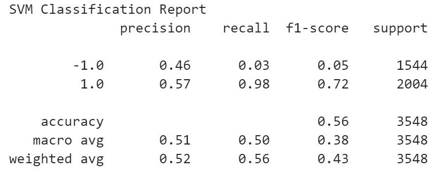
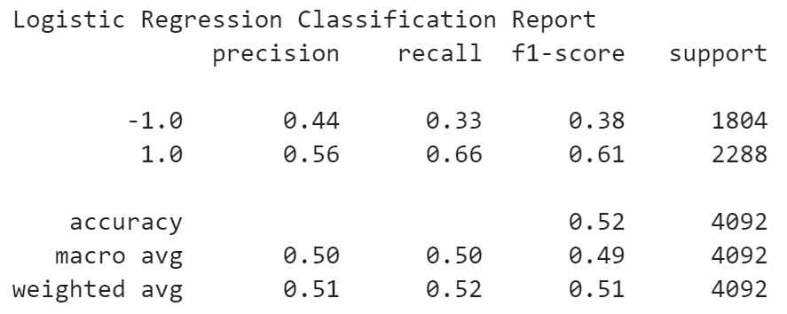
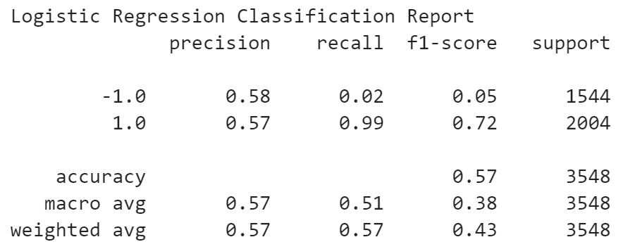

# Neural-Network-Alphabet

A Python based approach, using statistical analysis and regression for the purpose of optimizing an algorithmic trading strategy.

Analysis begins with identification of the key pieces of information the CSV and encoding into a separate DataFrame.

Rolling, simple moving averages for short_window and long_window are then setup and concatenated to the previous DataFrame.

These SMA are then fed into a simple signal identifier, where actual_returns greater than or equal to zero will trigger a buy for a long position in the stock, whereas values less than zero will trigger a sell for a short position in the stock.

The efficiency of the signal and SMA systems are determined by multiplying the actual_returns by the signal to give us the value of strategy_returns, which we then plot:

We proceed to setup a StandardScaler instance, identifying our y variable as the signal column (identifying opportunities for profit), and X as our SMA for short and long windows of trading periods.

The scaled y and X information is then fed into SKLearn’s support vector machine (SVM) to generate predictions based upon the testing data we have provided:

We move onto creating a new DataFrame, incorporating our X_test as our index, our SVM predictions output, and columns from the original CSV.

We then graph our actual results vs our strategic results to determine the course of our actions:

Looking at our value of strategy returns, we seem to have only a slight increase over time, leaving much room for improvement.

#Tuning of the algorithm

In the hopes for increasing the effectiveness of our algorithm, we start off by increasing our training dataset, from DateOffset, to a value of 10 months:

Our overall accuracy score has increased by 1 percentage point, with slight increases in recall for both sale and buy triggers.

We also manipulated the SMA dates, to periods of 10 days and 150 days, for further improvement:

Surprisingly, we managed to create an instance of 100% recall for the buy trigger for 1.0, a situation where all relevant elements are found.

Using the new parameters, we apply them together to provide our new, enhanced algorithm:

Attempting to validate our findings, we go onto creating a new machine learning model, using logistical regression and borrowed testing, SVM predictions, and CSV data.

Backtesting the model, we come upon the following result:

Of note, there isn't much difference found in the new LR model, though we have made great strides in change SMA dates and the data input into the model itself.

Comparing our original testing results to our final:

There are some differences worth pointing out, like increasing of precisicion, recall for both the buy and sell triggers, allong with an overall increase in accuracy by 1%.

However, if we are to look at the before and after for the logisitical regression model:

We can observe that our logistical regression yields precision, and accuracy when compared to our original model.

Therefore, we can confidently conclude that our newest model, using logistical regression, is an improvement over our tuned model.

---

## Technologies

This analysis runs on python version 3.7, with the following add-ons:

* [Pandas](https://pandas.pydata.org/) - For data analysis.

* [NumPy](https://numpy.org/) - For statistical computing.

* [hvPlot](https://hvplot.holoviz.org/) - For plot creation.

* [scikit-learn](https://scikit-learn.org/stable/) - For further statistical analysis.

---

## Contributors

Santiago Rosas
